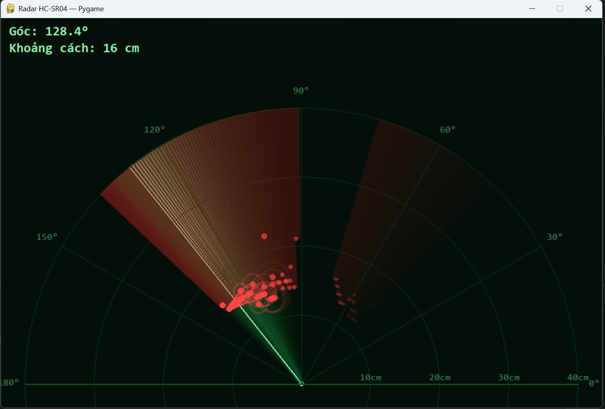

# Radar HC-SR04 + Servo — Pygame

Ứng dụng hiển thị radar thời gian thực bằng **Pygame**, nhận dữ liệu từ Arduino
(HC-SR04 gắn trên Servo quét 0°→180°) qua cổng **Serial**. Giao diện mô phỏng
màn hình radar cổ điển: tia quét phát sáng, vệt mờ dần (persistence), chấm vật
cản, và **vùng bị che khuất (shadow) phía sau vật cản**.


---


## Tính năng

- **Tia quét mượt** — nội suy góc (easing) nên chuyển động mượt dù Arduino
  chỉ gửi dữ liệu rời rạc mỗi ~20ms/bước.
- **Vệt mờ dần kiểu phosphor** — màn hình không xoá sạch từng frame mà làm mờ
  dần, tạo cảm giác radar thật.
- **Vật cản hiển thị màu đỏ** kèm **dải bóng (shadow) phía sau** — mô phỏng
  vùng sóng siêu âm không xuyên qua được vật cản.
- **Hiệu ứng gợn sóng (ping)** khi phát hiện vật ở gần (<40% tầm quét).
- **Chế độ giả lập `--sim`** — chạy thử giao diện không cần cắm Arduino.
- **Tự dò cổng Serial**, tự kết nối lại nếu rớt kết nối.
- Code chia module rõ ràng, **dễ chèn thêm hiệu ứng mới**.

---

## Cấu trúc project

```
Radar_realtime/
├── C_radar_rotating_mode.cpp            # Firmware Arduino: quét servo 0↔180°, đo HC-SR04, gửi Serial
├── Python_Radar_detector.py      # Ứng dụng hiển thị radar bằng Pygame
└── README.md
```

---

## Phần cứng & đấu nối (Arduino)

| Linh kiện        | Chân Arduino |
|-------------------|-------------|
| Servo (tín hiệu)  | D9          |
| HC-SR04 — Trig    | D5          |
| HC-SR04 — Echo    | D6          |
| HC-SR04 — VCC     | 5V          |
| HC-SR04 — GND     | GND         |

Firmware (`main.cpp`) quét servo từ 0°→180° rồi 180°→0°, mỗi bước 1°, đo
khoảng cách và gửi qua Serial theo định dạng:

```
<góc>,<khoảng_cách_cm>
```

Baudrate: **9600**.

> ⚠️ Nếu dùng PlatformIO/Arduino IDE, nạp `main.cpp` vào board trước khi chạy
> phần Python.

---

## Cài đặt (máy tính)

Yêu cầu Python 3.9+.

```bash
pip install pygame pyserial
```

---

## Chạy chương trình

```bash
# Tự tìm cổng Serial
python radar_pygame.py

# Chỉ định cổng cụ thể
python radar_pygame.py --port COM5           # Windows
python radar_pygame.py --port /dev/ttyUSB0   # Linux/macOS

# Đổi baudrate nếu cần
python radar_pygame.py --baud 9600

# Chạy giả lập, KHÔNG cần Arduino (test giao diện)
python radar_pygame.py --sim
```

Nhấn **ESC** hoặc đóng cửa sổ để thoát.

---

## Tuỳ chỉnh nhanh (trong `radar_pygame.py`, class `Config`)

| Thông số | Ý nghĩa |
|---|---|
| `MAX_DISTANCE_CM` | Tầm quét tối đa hiển thị trên radar (khớp tầm HC-SR04, mặc định 40cm) |
| `RING_COUNT` | Số vòng tròn khoảng cách trên lưới |
| `SWEEP_LERP_SPEED` | Độ mượt của tia quét (càng lớn tia bám sát dữ liệu thật càng nhanh) |
| `ECHO_LIFETIME` | Thời gian (giây) một điểm vật cản tồn tại trước khi mờ hẳn |
| `TRAIL_FADE_ALPHA` | Độ dài vệt mờ phía sau tia quét (càng nhỏ vệt càng dài) |
| `SHADOW_HALF_WIDTH_DEG` | Bề rộng góc của dải bóng phía sau vật cản |
| `COLOR_*` | Bảng màu giao diện |

---

## Kiến trúc code

- **`SerialReader`** — đọc Serial trong thread riêng, không làm khựng vòng lặp
  vẽ; tự kết nối lại khi mất kết nối.
- **`SimulatedReader`** — sinh dữ liệu giả lập cho chế độ `--sim`.
- **`Echo`** — đại diện một lần phát hiện vật cản, tự tính độ mờ theo tuổi.
- **`Radar`** — toàn bộ phần vẽ: lưới, tia quét, vệt mờ, chấm vật cản, dải
  bóng, hiệu ứng ping, HUD.

### Thêm hiệu ứng mới

Chỉ cần viết thêm một hàm `_draw_xxx(self)` trong class `Radar`, rồi gọi nó
trong `Radar.draw()`. Ví dụ: rung màn hình khi vật cản rất gần (<10cm) — thêm
logic vào `Radar.add_reading()`.

---

## Xử lý sự cố

| Hiện tượng | Nguyên nhân thường gặp |
|---|---|
| `Chưa cài pyserial` | Chạy `pip install pyserial` |
| Không tìm thấy cổng Serial | Kiểm tra Arduino đã cắm & đúng driver USB-Serial (CH340/FTDI...) |
| Radar không hiện vật cản | Kiểm tra dây Trig/Echo, khoảng cách phải trong tầm `MAX_DISTANCE_CM` |
| Tia quét giật, không mượt | Tăng `SWEEP_LERP_SPEED` hoặc giảm `delay(20)` trong `main.cpp` |
| Cổng Serial bị chiếm | Đóng Arduino IDE / Serial Monitor trước khi chạy Python |
